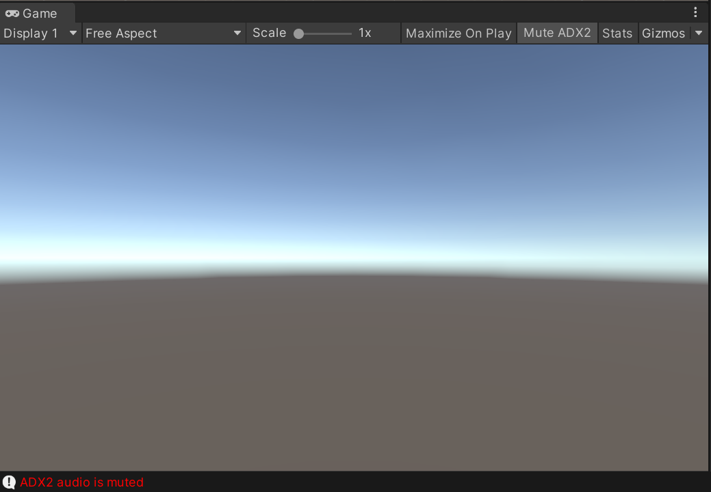

↓完全にこれの方がいいです。本repoは不要

https://gist.github.com/TakaakiIchijo/6d2f8573ac92e877a621e5aa679c7a18

# ADX2forUnityMuteButton
~~ADX2導入時のUnity EditorにおいてGame ViewにMute ADX2ボタンを表示する拡張~~ 

## 既知の不具合
### Atom SourceでPlayOnStartを利用している場合かシーン起動直後にADX2で音を鳴らしている場合、ミュートしていても0.5秒ほど鳴ってしまう
~~ ミュートに使用している関数CriAtomExAsr.SetBusVolumeがCri AtomやAtom Sourceより後に初期化されるため？~~ 

### Game Viewを小さくしたときにボタンが崩れる
~~ ボタンのstyle設定が適当であるため~~ 
